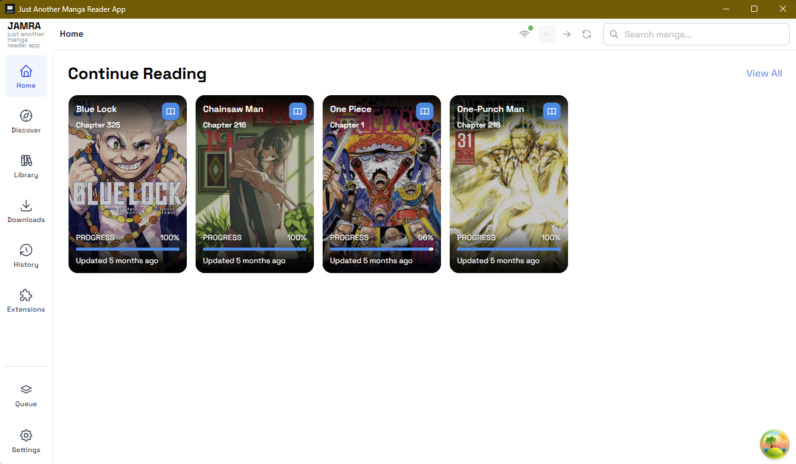

# JAMRA

A feature-rich manga reader desktop application built with Tauri, React, and Express.

<p align="center">
  
</p>

## Tech Stack

### Frontend

- **React 19** - UI library
- **Mantine 8** - Component library
- **TailwindCSS 4** - Styling
- **Zustand 5** - Client state management
- **TanStack Query 5** - Server state management
- **React Router 7** - Routing

### Backend

- **Express 5** - REST API server
- **Better-SQLite3 12** - Database (with cross-platform support)
- **Node.js 20+** - Runtime (required)

### Desktop

- **Tauri 2** - Rust-based desktop wrapper
- **Rust (stable)** - Host runtime that spawns the bundled Node/Express server

### Desktop Runtime Notes

- Development runs `pnpm dev` (Vite + server) while `tauri dev` opens the native shell.
- Packaged builds run the compiled Express server via Tauri on port `3000`.
- Packaged builds ship with a Node.js runtime (24.x) so end users don't need Node installed; development still requires Node 24+ locally.

> **Note**: Version numbers listed above represent major versions. For exact dependency versions, refer to `package.json`.

## Architecture

The app uses a **modular REST API architecture** with an extension system:

- **Backend Server**: Express REST API on `http://localhost:3000`
- **Frontend**: React SPA accessible in the Tauri shell OR browser
- **Database**: SQLite for local storage
- **Extensions**: Modular system for manga sources (weebcentral, batoto, etc.)
- **WebSocket**: Real-time updates for downloads and progress
- **Cross-Platform**: Windows, macOS, Linux

## Project Structure

```
JAMRA/
├── server/                 # Express backend
│   ├── src/
│   │   ├── app/           # Express app & route registration
│   │   ├── core/          # Configuration, database, infrastructure
│   │   ├── database/      # SQLite schema & migrations (legacy)
│   │   ├── modules/       # Modular architecture
│   │   │   ├── catalog/   # Catalog service + drivers
│   │   │   ├── extensions/# Extension registry, loader, runtime
│   │   │   ├── installer/ # Extension installation workflow
│   │   │   └── settings/  # Server/client configuration
│   │   ├── sdk/           # Extension SDK for developers
│   │   ├── shared/        # Cross-cutting utilities (HTTP, logger)
│   │   ├── types/         # Legacy TypeScript types
│   │   └── websocket/     # WebSocket handlers for real-time updates
│   └── tsconfig.json
├── src-tauri/            # Tauri Rust project (desktop shell + server launcher)
│   ├── src/main.rs       # Spawns the production Express server
│   ├── tauri.conf.json   # Bundling/dev configuration
│   └── Cargo.toml        # Rust manifest
├── src/                   # React frontend
│   ├── components/       # UI components
│   ├── hooks/queries/    # TanStack Query hooks
│   ├── pages/            # Route pages
│   ├── store/            # Zustand stores
│   ├── api/              # API client
│   ├── routes/           # React Router config
│   └── constants/        # API endpoints, WebSocket events, UI constants
├── resources/             # Extension bundles & assets
│   └── extensions/       # Local extensions (weebcentral, batoto, etc.)
└── data/                  # User data (created at runtime)
    ├── database/         # SQLite database
    └── downloads/        # Downloaded manga
```

## Getting Started

### Prerequisites

- **Node.js 20+** (required for better-sqlite3 v12)
- **pnpm** (recommended)

### Installation

```bash
# Install dependencies (will trigger postinstall for native deps)
pnpm install
```

### Development

**Option 1: Run in Browser (Faster for UI Development)**

```bash
# Terminal 1: Start backend server
pnpm dev:server

# Terminal 2: Start Vite dev server
pnpm dev

# Open http://localhost:5173 in your browser
```

**Option 2: Run the Native Shell (Tauri)**

```bash
# Start the dev shell (spawns pnpm dev under the hood)
pnpm desktop

# Tauri opens a native window pointing at the Vite dev server.
# The backend server is already running because `pnpm dev` runs both halves.
```

### Building

```bash
# Build frontend
pnpm build:frontend

# Build backend
pnpm build:server

# Build frontend + backend together (no desktop packaging)
pnpm build:app

# Build a signed/bundled desktop app (runs `pnpm build:app` automatically)
pnpm build
```

### Log Files (for debugging packaged exe)

- Main/server logs: `%APPDATA%/JAMRA/logs/main.log`
- On macOS: `~/Library/Application Support/JAMRA/logs/main.log`
- On Linux: `~/.config/JAMRA/logs/main.log`

# Manual Verification Checklist

Before cutting a release or publishing new installers, run the manual smoke steps in [`docs/manual-verification-checklist.md`](docs/manual-verification-checklist.md). The checklist walks through:

- Building a packaged Tauri bundle (`pnpm build`).
- Launching the installer/portable build and verifying migrations completed.
- Hitting `http://localhost:3000/health` once the bundled server boots.
- Spot-checking `%APPDATA%/JAMRA` (or platform equivalent) for the SQLite DB and log outputs.

Document any anomalies you uncover so the next run has known-good reference points. A dedicated Tauri packaging checklist is in-flight; until then, treat the existing Electron-focused doc as a legacy reference.
| `JAMRA_SMOKE_TIMEOUT` | `20000` (ms) | Max wait before declaring failure. |
| `JAMRA_SMOKE_TMP` | `<repo>/.tmp-smoke` | Location for temporary DB/log artifacts. |

If the script fails, inspect the emitted `[server]` logs and rerun after addressing the issue.

## State Management

### Zustand Stores (Client State)

- **useLibraryStore** - Library UI state (view mode, selection, sorting)
- **useReaderStore** - Reader state (current page, fullscreen)
- **useSettingsStore** - App settings (persisted to localStorage)
- **useUIStore** - Global UI state (modals, sidebars)

### TanStack Query (Server State)

- **useLibraryQueries** – Library list/detail, stats, and reading progress sync
- **useDownloadQueries** – Download queue, stats, and queue/cancel mutations
- **useExtensionsQueries** – Extension registry, search, manga, chapters, and page descriptors

## API Endpoints

All endpoints accessible at `http://localhost:3000/api`

### Catalog

- `GET /api/catalog` - Get cached catalog entries
- `POST /api/catalog/sync` - Refresh catalog from remote repository

### Extensions

- `GET /api/extensions` - List installed extensions
- `GET /api/extensions/:id` - Get extension details
- `GET /api/extensions/:id/search` - Search manga via extension
- `GET /api/extensions/:id/manga/:mangaId` - Get manga details + chapters
- `GET /api/extensions/:id/manga/:mangaId/chapters` - Get chapters only
- `GET /api/extensions/:id/manga/:mangaId/chapters/:chapterId/pages` - Get page URLs
- `POST /api/extensions/install` - Install extension (in progress)

### Installer

- Extension installation endpoints (in development)

### Settings

- Server and client configuration endpoints

### WebSocket Events

Real-time updates via WebSocket:

- `download:started` - Download started
- `download:progress` - Download progress update
- `download:page:complete` - Page download completed
- `download:chapter:complete` - Chapter download completed
- `download:failed` - Download failed
- `download:cancelled` - Download cancelled

## Cross-Platform Notes

### Better-SQLite3 Considerations

Better-SQLite3 uses **native bindings** which require special handling:

1. **Native Bindings**: Built during `pnpm install` for the active system Node.js runtime (24+ recommended). Re-run `pnpm rebuild better-sqlite3` after upgrading Node.

2. **Packaging targets**: `pnpm build` must be executed on each OS you intend to support so the Rust bundle links against the proper system libraries.

3. **Testing**: Build and test on each target platform:
   - Windows x64/arm64
   - macOS Intel/Apple Silicon
   - Linux x64/arm64

4. **Troubleshooting**: If native bindings fail:
   - Ensure Node.js 24+ is installed
   - Remove `node_modules` and reinstall (`pnpm install`)
   - Confirm the bundled app can locate the shipped `node_modules` folder

## Scripts

- `pnpm dev` - Run Vite frontend + Express backend concurrently
- `pnpm dev:frontend` - Start the Vite dev server only
- `pnpm dev:server` - Start Express backend with watch mode
- `pnpm desktop` - Launch the native Tauri shell wired to Vite dev server
- `pnpm build:frontend` - Build frontend for production
- `pnpm build:server` - Build backend for production
- `pnpm build:app` - Compile frontend + backend without packaging
- `pnpm build` - Create a release-ready Tauri bundle for the host OS
- `pnpm lint` - Run ESLint
- `pnpm test:extensions` - Validate bundled extensions (manifest + compiler harness)

## Routes

- `/` - Home page
- `/discover` - Discover new manga
- `/library` - Library view
- `/downloads` - Download queue
- `/history` - Reading history
- `/extensions` - Browse and manage extensions
- `/settings` - App settings
- `/manga/:id` - Manga details
- `/reader/:chapterId` - Full-screen reader

## Features & Roadmap

### Implemented

- ✅ Extension system for manga sources
- ✅ Local extension support (weebcentral, batoto)
- ✅ WebSocket real-time updates
- ✅ Download progress tracking
- ✅ Modular backend architecture
- ✅ Cross-platform builds (Windows, macOS, Linux)

### In Progress

- 🚧 Extension installer API
- 🚧 Catalog sync from remote repositories
- 🚧 Extension settings UI

### Planned

- 📋 Download queue worker with retry logic
- 📋 Reader enhancements (page preloading, keyboard shortcuts)
- 📋 Library search and advanced filtering
- 📋 Reading history tracking
- 📋 Manga recommendations

## License

Private project
